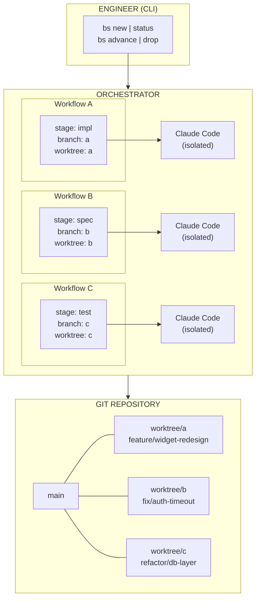
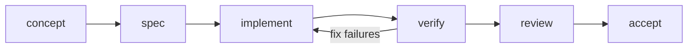

# bs — Bootstrap Workflow Orchestrator

## Overview

`bs` is a CLI tool from the bs-factory development tooling repository. It
orchestrates AI-driven development workflows by managing Claude Code instances
in isolated git worktrees.

## Problem Statement

Engineers working on a project need to run multiple development workflows in
parallel — features, bug fixes, refactors — each progressing independently
through a full development lifecycle from concept to acceptance. Different
engineers may be responsible for different workflows or stage boundaries.

Claude Code is effective as a single-agent development tool but fails at
self-orchestration: sub-agents inherit the parent's working directory, context
compaction causes CWD drift, and worktree isolation is unreliable when managed
from inside Claude Code itself. The result is edits landing in the wrong
directory, commits hitting protected branches, and workflows bleeding into each
other.

The solution is an external orchestrator that owns process lifecycle, directory
isolation, and workflow state — while delegating actual development work to
Claude Code instances that each operate in a fully isolated environment.


## Design Principles

1. **Hard isolation by default.** Each workflow gets its own git worktree and
   its own Claude Code process. No shared filesystem access between workflows.
   The orchestrator enforces this at the process level, not by instructing
   agents to behave.

2. **Lifecycle-driven, not task-driven.** Workflows progress through defined
   stages. Each stage has entry criteria, an agent prompt, and exit criteria.
   The orchestrator advances workflows through stages — it doesn't manage
   individual tasks within a stage.

3. **Engineer-in-the-loop at stage boundaries.** The orchestrator never
   auto-advances a workflow to the next stage. The engineer reviews output,
   decides whether to advance, revise, or abandon. Within a stage, the agent
   operates autonomously.

4. **Stateless agents, stateful orchestrator.** Claude Code instances are
   ephemeral. All durable state lives in the orchestrator's workflow manifest
   files. An agent can be killed and re-spawned at any stage without data loss.

5. **Minimal surface area.** The MVP is a CLI tool with a small command set.
   No web UI, no daemon, no database. State is flat files. Orchestration logic
   is a shell script or single Python file.


## Architecture




## Workflow Lifecycle

A workflow progresses through six stages. Each stage defines what the agent
does, what it produces, and what the engineer evaluates before advancing.



### Stage Definitions

#### 1. CONCEPT
- **Input:** Engineer provides a short description (1-3 sentences).
- **Agent work:** None. This is engineer-only.
- **Output:** The description is recorded in the workflow manifest.
- **Advance criteria:** Engineer is satisfied the concept is clear enough to
  spec.

#### 2. SPEC
- **Input:** Concept description + repository context.
- **Agent work:** Claude Code analyzes the codebase, asks clarifying questions
  (written to a questions file the engineer reviews async), and produces a
  specification document covering: what changes, where in the codebase, what
  the acceptance criteria are, and what risks or dependencies exist.
- **Output:** `SPEC.md` in the worktree root.
- **Advance criteria:** Engineer reviews the spec, approves or requests
  revisions (re-run the stage with feedback).

#### 3. IMPLEMENT
- **Input:** Approved spec + worktree with clean branch.
- **Agent work:** Claude Code implements the changes described in the spec.
  Commits incrementally to the workflow branch. Follows any project conventions
  in CLAUDE.md.
- **Output:** Working code committed to the workflow branch.
- **Advance criteria:** Engineer reviews the diff, confirms implementation
  matches spec intent.

#### 4. VERIFY
- **Input:** Implementation on the workflow branch.
- **Agent work:** Claude Code runs the project's test suite, linter, type
  checker, and build. If failures occur, it attempts to fix them (looping
  within this stage up to a configurable retry limit). If it cannot resolve
  failures, it writes a `VERIFY-FAILURES.md` describing what failed and why.
- **Output:** Clean CI-equivalent pass, or a failure report.
- **Advance criteria:** All checks pass. If failures persist, engineer decides
  whether to send the workflow back to IMPLEMENT with guidance, or intervene
  manually.

#### 5. REVIEW
- **Input:** Verified branch.
- **Agent work:** Claude Code performs a self-review of the full diff against
  the spec. Produces a `REVIEW.md` covering: spec compliance, code quality
  observations, edge cases, and any concerns. This is not a rubber stamp — the
  agent is prompted to be critical.
- **Output:** `REVIEW.md` in the worktree root.
- **Advance criteria:** Engineer reads the review alongside the diff and
  makes a judgment call.

#### 6. ACCEPT
- **Input:** Reviewed branch.
- **Agent work:** None. This is engineer-only.
- **Engineer action:** Merge the branch (squash, rebase, or merge commit per
  project convention), clean up the worktree. The orchestrator records the
  workflow as complete.
- **Output:** Branch merged, worktree removed, workflow archived.


## Workflow Manifest

Each workflow is tracked by a manifest file stored in the repository at
`.bs/workflows/<id>.yaml`. This is the orchestrator's single source of truth.

```yaml
id: widget-redesign
created: 2026-03-27T10:00:00Z
concept: >
  Redesign the dashboard widget component to support resizable panels
  with drag-and-drop reordering.
stage: implement
branch: feature/widget-redesign
worktree: .worktrees/widget-redesign

history:
  - stage: concept
    entered: 2026-03-27T10:00:00Z
    completed: 2026-03-27T10:02:00Z

  - stage: spec
    entered: 2026-03-27T10:02:00Z
    completed: 2026-03-27T10:45:00Z
    iterations: 2
    notes: "Revised scope after first pass — removed animation requirement."

  - stage: implement
    entered: 2026-03-27T10:46:00Z
    completed: null
    pid: 48291

config:
  verify_retries: 3
  model: sonnet
```


## CLI Interface

```
bs new "<concept>"          Create a new workflow, set up branch + worktree
bs status                   Show all workflows and their current stages
bs run <id>                 Spawn Claude Code for the current stage
bs advance <id>             Move workflow to the next stage
bs revise <id> "<feedback>" Re-run the current stage with engineer feedback
bs back <id>                Move workflow back one stage
bs drop <id>                Abandon workflow, clean up branch + worktree
bs log <id>                 Show stage history for a workflow
```

### Example Session

```bash
# Morning: engineer queues up three pieces of work
$ bs new "Add rate limiting to the /api/search endpoint"
Created workflow: rate-limit (stage: concept)

$ bs new "Fix timezone bug in event scheduler — times off by 1hr in DST"
Created workflow: tz-fix (stage: concept)

$ bs new "Extract database queries from handlers into a repository layer"
Created workflow: repo-layer (stage: concept)

# Advance all three to spec stage and kick off agents
$ bs advance rate-limit && bs run rate-limit
$ bs advance tz-fix && bs run tz-fix
$ bs advance repo-layer && bs run repo-layer

# All three agents are now running in parallel, each in its own worktree.
# Engineer does other work. Checks back later.

$ bs status
  rate-limit   spec        ● running   .worktrees/rate-limit
  tz-fix       spec        ✓ done      .worktrees/tz-fix
  repo-layer   spec        ● running   .worktrees/repo-layer

# Review the tz-fix spec, looks good, advance to implement
$ cat .worktrees/tz-fix/SPEC.md
$ bs advance tz-fix && bs run tz-fix

# rate-limit spec needs revision
$ cat .worktrees/rate-limit/SPEC.md
$ bs revise rate-limit "Use token bucket, not sliding window. 100 req/min."
```


## Process Isolation Model

This is the core of the design — how the orchestrator guarantees that each
Claude Code instance is truly isolated.

### Worktree Setup

When `bs new` runs:

1. Create a branch from the current HEAD: `git branch <workflow-branch>`
2. Create a worktree: `git worktree add .worktrees/<id> <workflow-branch>`
3. Write the manifest to `.bs/workflows/<id>.yaml`

### Agent Spawning

When `bs run <id>` runs:

1. Read the manifest to determine current stage and worktree path.
2. Resolve the worktree to an **absolute path**.
3. Spawn Claude Code as a child process with:
   - `cwd` set to the worktree's absolute path
   - A stage-specific system prompt injected via `--prompt` or piped stdin
   - The `--model` flag if the workflow specifies a model preference
4. Record the PID in the manifest.
5. The orchestrator does **not** run inside Claude Code. It is a separate
   process (shell script or Python) that invokes `claude` as a subprocess.

### Why This Works

- Claude Code's CWD is set by the OS at process spawn time. The agent cannot
  drift to another directory because it was never started there.
- There is no parent Claude Code session whose context could compact and
  corrupt the CWD.
- Each agent reads CLAUDE.md from its own worktree (which may be a symlink
  or copy of the project root's CLAUDE.md — the orchestrator handles this
  during worktree setup).
- Git prevents two worktrees from checking out the same branch, so branch
  conflicts are structurally impossible.


## Stage Prompts

Each stage has a template prompt that the orchestrator fills in and passes to
Claude Code. These are stored in `.bs/prompts/` and can be customized per
project.

### Example: SPEC Stage Prompt

```
You are working on the following task:

{concept}

Your working directory is the root of a git worktree for this task.
The branch is: {branch}

Your job is to produce a specification document (SPEC.md) in this directory.

Analyze the codebase to understand:
- Where the relevant code lives
- What needs to change
- What the dependencies and risks are

Write SPEC.md with these sections:
1. Summary — what this change does in 2-3 sentences
2. Changes — specific files and functions that need modification
3. Acceptance Criteria — how we'll know this is done (testable statements)
4. Risks & Dependencies — what could go wrong, what else is affected
5. Open Questions — anything you need the engineer to clarify

If you have questions that block your work, write them to QUESTIONS.md.

Do not implement anything. Spec only.
```


## What This Spec Does NOT Cover (Future Extensions)

These are explicitly out of scope for the MVP but are natural next steps:

- **Parallel stage execution within a workflow** (e.g. running tests and
  linting concurrently in the verify stage)
- **Automatic CI integration** (triggering real CI pipelines instead of
  local verification)
- **Workflow dependencies** (e.g. "repo-layer must complete before
  rate-limit can implement")
- **Cost tracking** (token usage per stage per workflow)
- **Multiple projects** (the MVP assumes one git repository)
- **Notification system** (email/slack when a stage completes)
- **Diff-based stage re-entry** (resuming an interrupted implementation
  without re-running from scratch)
- **Custom stages** (allowing engineers to define project-specific stages)
- **Agent memory across stages** (passing context from spec → implement
  beyond just the SPEC.md file)


## Implementation Notes for MVP

The MVP can be implemented as a single Bash script (~300-500 lines) or a
small Python CLI (~400-600 lines). Key implementation choices:

- **State:** YAML files in `.bs/workflows/`. No database.
- **Process management:** Direct subprocess spawn via `claude` CLI.
  Background with `&` or `nohup`. PID tracking for status checks.
- **Prompts:** Markdown templates in `.bs/prompts/` with `{variable}`
  placeholders. `envsubst` or Python string formatting.
- **Git operations:** Direct `git` CLI calls. No library dependency.
- **Worktree cleanup:** `git worktree remove` + `git branch -d` on `bs drop`.
- **Dependencies:** Git, Claude Code CLI. Optional: `yq` for YAML parsing
  in the Bash variant.
